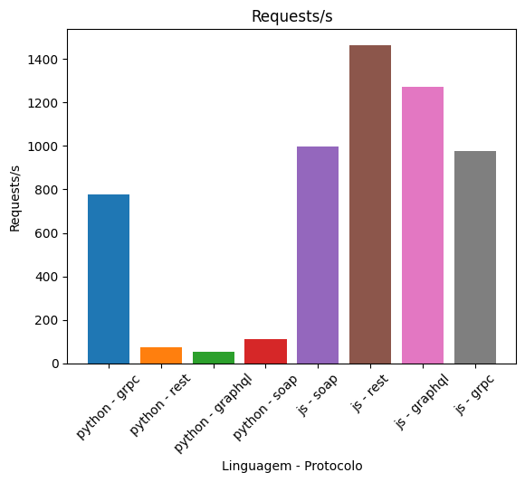
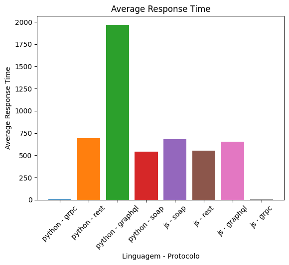
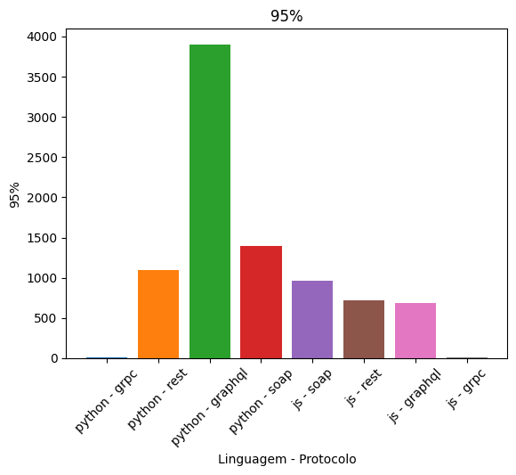
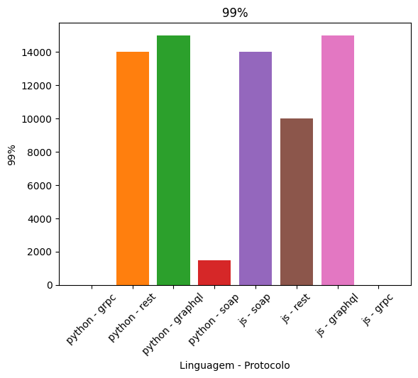
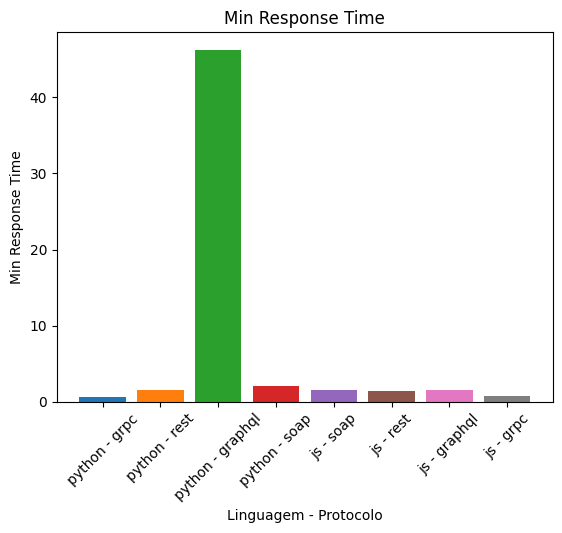
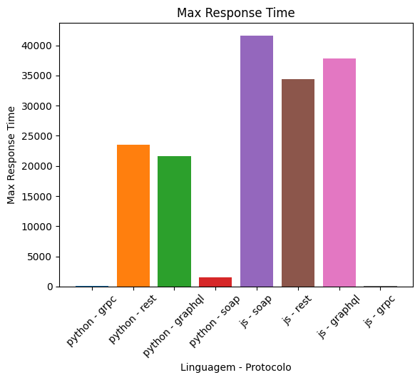
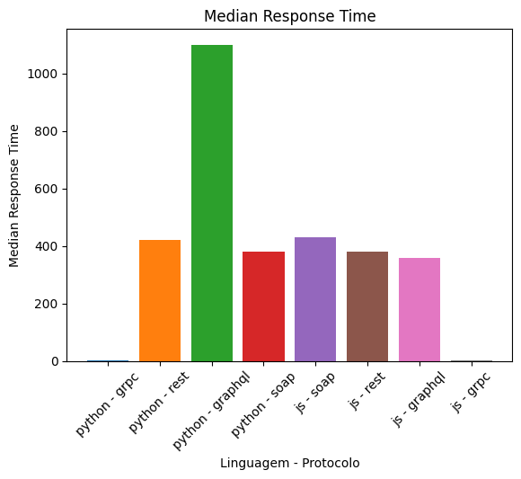
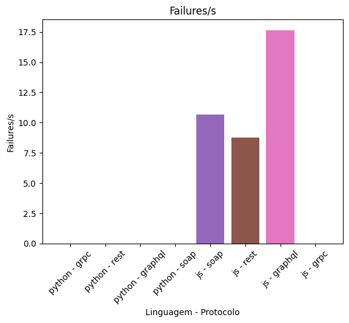
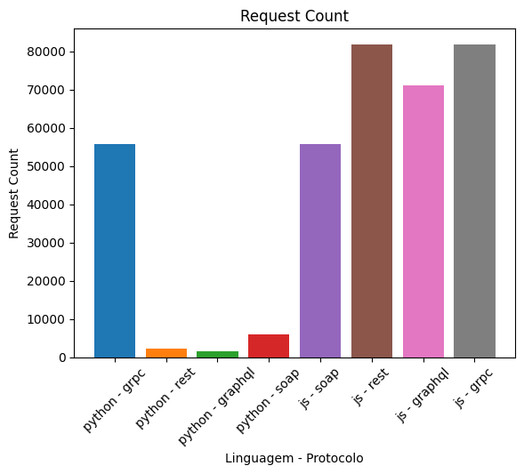

Sistemas Distribuídos - Unifor 25.2

Filipe Tavares Soares

Rafael da Silva Albuquerque

# Comparação de Tecnologias de Invocação Distribuída

Este projeto visa comparar o desempenho e as características de diferentes tecnologias de invocação remota: SOAP, REST, GraphQL e gRPC, implementadas em servidores Node.js e Python.

## 1. Descrição das Tecnologias

### SOAP (Simple Object Access Protocol)

**Como funciona:**
O SOAP é um protocolo de comunicação baseado estritamente em XML, desenhado para permitir a troca de informações estruturadas entre sistemas distribuídos. Diferente de estilos arquiteturais, o SOAP é um protocolo com regras rígidas.

* **Estrutura da Mensagem:** Cada mensagem SOAP é um documento XML contendo um **Envelope** (que define o início e o fim da mensagem), um **Header** (opcional, para metadados como autenticação e transações) e um **Body** (contendo o payload real da chamada e informações de erro/falha).
* **WSDL:** Depende de documentos WSDL (Web Services Description Language), que funcionam como um contrato formal, descrevendo exaustivamente os métodos disponíveis, parâmetros esperados e tipos de retorno.

**Principais Vantagens:**

* **Padrões WS-*:** Oferece um conjunto maduro de especificações estendidas para segurança de nível empresarial (**WS-Security**), atomicidade de transações distribuídas (**WS-AtomicTransaction**) e garantia de entrega de mensagens (**WS-ReliableMessaging**).
* **Independência de Transporte:** Embora o HTTP seja o mais comum, o SOAP pode ser transportado via SMTP, TCP, UDP ou JMS, oferecendo flexibilidade em ambientes corporativos complexos.
* **Tipagem e Validação:** O contrato WSDL permite validação rigorosa antes mesmo da execução, reduzindo erros de tempo de execução.

**Principais Desvantagens:**

* **Verbosidade Extrema:** O formato XML, somado à estrutura de envelopes e namespaces, gera mensagens significativamente maiores que seus equivalentes em JSON ou binário, consumindo mais largura de banda.
* **Custo Computacional:** O processo de serialização e parsing de XML é intensivo em CPU, o que pode impactar a performance e aumentar a latência.
* **Rigidez:** Alterações na API podem quebrar clientes existentes facilmente se o contrato WSDL mudar, exigindo regeração de stubs.

**Situações de Uso:**
Ainda é amplamente utilizado em **sistemas legados**, **setores bancários**, **seguradoras** e **governamentais** onde requisitos não funcionais como segurança assinada, criptografia de mensagem parcial e transações ACID distribuídas são mandatórios.

---

### REST (Representational State Transfer) com JSON

**Como funciona:**
REST não é um protocolo, mas um **estilo arquitetural** que impõe restrições como a interface uniforme e a ausência de estado (statelessness).

* **Recursos e Verbos:** Foca na manipulação de "Recursos" identificados por URIs (ex: `/usuarios/123`). Utiliza os métodos semânticos do protocolo HTTP (GET para ler, POST para criar, PUT/PATCH para atualizar, DELETE para remover).
* **Stateless:** O servidor não armazena o estado da sessão do cliente entre requisições; cada requisição deve conter todas as informações necessárias para ser processada.
* **JSON:** Embora suporte múltiplos formatos, o JSON tornou-se o padrão de facto para representação devido à sua compatibilidade direta com JavaScript e legibilidade.

**Principais Vantagens:**

* **Escalabilidade e Cache:** Por respeitar a semântica HTTP, aplicações REST podem se beneficiar nativamente de infraestruturas de cache da web (CDNs, proxies, navegadores), melhorando a performance de leitura.
* **Desacoplamento:** Permite que frontend e backend evoluam separadamente, desde que a interface dos recursos seja mantida.
* **Simplicidade:** Fácil de iniciar e testar (basta um navegador ou cURL). Possui uma curva de aprendizado baixa e ferramentas abundantes.

**Desvantagens:**

* **Over-fetching e Under-fetching:** Problema clássico onde o cliente recebe dados inúteis para sua view (over) ou precisa realizar múltiplas chamadas em sequência para montar uma tela (under), gerando o problema de "n+1" requisições na rede.
* **Falta de Padronização de Metadados:** Diferente do SOAP (Header) ou gRPC, não há um padrão rígido para envio de metadados, paginação ou filtragem, levando a implementações ad-hoc.

**Situações de Uso:**
É a escolha padrão para **APIs Públicas (Open APIs)**, backends de aplicações **Web/Mobile**, e arquiteturas de **microserviços** que priorizam simplicidade e integração facilitada com terceiros.

---

### GraphQL

**Como funciona:**
O GraphQL é uma **linguagem de consulta (query language)** para APIs e um runtime para cumprir essas consultas.

* **Endpoint Único:** Diferente do REST, o GraphQL expõe geralmente um único endpoint (ex: `/graphql`).
* **Controle pelo Cliente:** O cliente envia uma query descrevendo exatamente a estrutura de dados que necessita. O servidor processa e retorna um JSON espelhando essa estrutura.
* **Schema e Resolvers:** O servidor define um Schema tipado. "Resolvers" são funções responsáveis por buscar os dados para cada campo do schema, podendo vir de bancos de dados, outras APIs ou arquivos.

**Principais Vantagens:**

* **Busca Precisa (No Over/Under-fetching):** O cliente baixa apenas o que precisa, economizando banda (crucial para mobile).
* **Agregação de Fontes:** Excelente para atuar como um "BFF" (Backend For Frontend), agregando dados de múltiplos microserviços ou bancos de dados em uma única resposta coerente para o cliente.
* **Introspecção:** O sistema de tipos permite ferramentas poderosas de documentação automática e autocompletar (como o GraphiQL).

**Desvantagens:**

* **Complexidade de Cache:** Como a maioria das requisições usa POST e o endpoint é único, o cache HTTP tradicional (baseado em URL) não funciona. É necessário implementar cache no nível da aplicação ou usar clientes inteligentes (Apollo/Relay).
* **Vulnerabilidade a Consultas Complexas:** Um cliente mal-intencionado ou descuidado pode enviar queries profundamente aninhadas que derrubam a performance do servidor.
* **Curva de Aprendizado:** Exige que o time aprenda uma nova linguagem de definição de schemas e paradigmas de resolução de grafos.

**Situações de Uso:**
Aplicações com **frontends complexos e ricos em dados** (ex: Dashboards, Feeds sociais), **aplicações mobile** onde a rede é instável ou custosa, e como camada de unificação sobre múltiplos serviços existentes.

---

### gRPC (gRPC Remote Procedure Calls)

**Como funciona:**
O gRPC é um framework de RPC moderno de alto desempenho, open-source, desenvolvido pelo Google e parte da CNCF.

* **Protocol Buffers (Protobuf):** Utiliza Protobuf como IDL (Interface Definition Language) e formato de serialização. Os dados são convertidos para binário, tornando-os muito menores e mais rápidos de processar que JSON/XML.
* **HTTP/2:** Baseia-se exclusivamente em HTTP/2, permitindo multiplexação (várias requisições em uma conexão TCP), compressão de headers e priorização.
* **Streaming:** Suporta nativamente quatro modos: Unário (request/response simples), Server Streaming, Client Streaming e Streaming Bidirecional.

**Principais Vantagens:**

* **Performance Extrema:** A combinação de serialização binária compacta com a eficiência do HTTP/2 resulta em latência baixíssima e alto throughput.
* **Geração de Código (Polyglot):** A partir de um arquivo `.proto`, gera-se automaticamente o código do cliente e do servidor ("stubs") para dezenas de linguagens, garantindo tipos fortes e consistência.
* **Contrato Estrito e Evolução:** Protobuf gerencia bem a compatibilidade retroativa (backward compatibility), permitindo evoluir APIs sem quebrar clientes antigos.

**Desvantagens:**

* **Depuração Difícil:** Como o tráfego é binário, não é legível por humanos. Requer ferramentas específicas para inspeção, diferente do REST/JSON que pode ser lido em texto puro.
* **Suporte Web Limitado:** Navegadores não suportam gRPC nativamente (devido ao controle limitado sobre frames HTTP/2). É necessário usar um proxy intermediário (gRPC-Web) para conectar frontends web.
* **Acoplamento:** Embora gere código para várias linguagens, cliente e servidor ficam fortemente acoplados ao arquivo `.proto`.

**Situações de Uso:**
Ideal para comunicação interna entre **microserviços** (tráfego "East-West") em data centers, sistemas distribuídos de **tempo real**, jogos multiplayer, e ambientes onde cada milissegundo de latência conta.

## 2. Funcionalidades e Implementação

### Funcionalidades das APIs

Todas as implementações (Node.js e Python) fornecem funcionalidades equivalentes para permitir o teste de carga justo. As APIs expõem operações de leitura para três entidades principais:

* **Usuários:** Busca de todos os usuários e busca de usuário específico por ID.
* **Músicas:** Busca de todas as músicas, busca de música específica por ID, busca todas as músicas de uma playlist pelo ID da playlist.
* **Playlists:** Busca todas as playlists de um usuário pelo ID do usuário, busca de playlist específica por ID, busca de todas as playlist que possuem uma música específica através do ID da música.

### Comparativo de Implementação (Get User by ID)

Abaixo, apresentamos o código responsável por buscar um usuário pelo ID em cada uma das 8 variações testadas. Note como a complexidade e o estilo de código variam conforme a tecnologia e a linguagem, mas que sempre buscam a reutilização dos mesmos códigos de caso de uso ou da camada de serviço.

#### REST

**Python (FastAPI)**

```python
@user_router.get("/{id_}", response_model=FastapiUser | None)
async def get_user_by_id(
    id_: int,
    use_case: GetUserByIdUseCase = Depends(get_user_by_id_service)
):
    user: User | None = await use_case(id_)
    return FastapiUser.from_domain(user) if user else None
```

**JavaScript (Express)**

```javascript
router.get('/:id', async (req, res) => {
  const { id } = req.params;
  try {
    const usuarios = await userService.getUserById(id);
    if (usuarios) {
      res.json(usuarios);
    } else {
      res.status(404).json({ error: 'usuarios not found' });
    }
  } catch (error) {
    console.error('Error fetching usuarios:', error);
    return res.status(500).json({ error: 'Internal Server Error' });
  }
});
```

#### GraphQL

**Python (Strawberry)**

```python
    @strawberry.field(
        name="getUserById", description="Get a user by id"
    )  # type: ignore[misc]
    async def get_user_by_id(
        self, info: Info[GraphQLContext], id_: int
    ) -> StrawberryUser | None:
        use_case: GetUserByIdUseCase = info.context.container.resolve(
            GetUserByIdUseCase
        )
        user: User | None = await use_case(id_)
        return StrawberryUser.from_domain(user) if user else None
```

**JavaScript (Express-GraphQL)**

```javascript
  getUser: async ({ id }) => {
    const user = await userService.getUserById(id);
    return convertTypes(user);
  },
```

#### SOAP

**Python (Spyne)**

```python
    @rpc(Integer, _returns=SpyneUser)
    def get_user_by_id(ctx: SpyneContext, id_: int) -> SpyneUser | None:
        container: punq.Container = ctx.udc[SPYNECONSTS.CONTAINER]
        get_user_by_id_use_case: GetUserByIdUseCaseSync = container.resolve(
            GetUserByIdUseCaseSync
        )

        user: User | None = get_user_by_id_use_case(id_)

        return SpyneUser.from_domain(user) if user else None
```

**JavaScript (node-soap)**

```javascript
      GetUser: async function (args, callback) {
        try {
          const id = parseInt(args.id, 10);
          const user = await userService.getUserById(id);

          callback(null, convertTypes(user));
        } catch (error) {
          callback({
            Fault: {
              Code: { Value: 'soap:Sender', Subcode: { value: 'rpc:BadArguments' } },
              Reason: { Text: error.message }
            }
          });
        }
      },
```

#### gRPC

**Python (gRPCio)**

```python
    def GetUser(self, request, context) -> user_pb2.User:
        use_case: GetUserByIdUseCaseSync = self.container.resolve(GetUserByIdUseCaseSync)
        user: DomainUser = use_case(request.id)
        return GrpcUserHelper.from_domain(user)
```

**JavaScript (@grpc/grpc-js)**

```javascript
  GetUser: async (call, callback) => {
    try {
      const user = await userService.getUserById(call.request.id);
      callback(null, { ...convertTypes(user) });
    } catch (err) {
      handleError(err, callback);
    }
  },
```

## 3. Resultados

Abaixo estão os gráficos gerados a partir dos testes de carga realizados, comparando as diferentes tecnologias.

### Requisições por Segundo



### Tempo Médio de Resposta



### Percentil 95 (P95)



### Percentil 99 (P99)



### Tempo Mínimo e Máximo


|                  Mínimo                  |                  Máximo                  |
| :----------------------------------------: | :----------------------------------------: |
|  |  |

### Mediana



### Taxa de Falhas



### Contagem Total



## 4. Análise

Observamos uma grande diferença na capacidade de carga entre as duas linguagens utilizadas. Para o servidor em javascript (node.js) foi utlizado o framework *express*, que demostrou ter grande robustes comparado a implementação em python utilizando *fastapi* e *uvicorn*. O servidor em node.js suportou cerca de 10 vezes mais usários simulados antes de apresentar uma taxa de erro acima de 5%. Nos dois casos o mesmo servidor foi utilizado para as tecnologias rest, soap e graphql. Já para os servidores grpc, cada linguagem teve um servidor exclusivo para essa ferramenta, visto que não é compatível com o http padrão das outras tecnologias.

Guardadas as devidas proporções de quantidades de usuários, e a capacidade de cada servidor obtivemos resultados semelhantes entre as linguagnes. O grpc obtve o melhor resultado em ambas as ligagens, e com tempos de resposta muito similares, demonstrando que a comunicação por aquivos binários comprimidos é extremamente eficiente.

Já para as outras tecnologias, no geral tivemos resultados semelhantes, exceto para o graphql em python que foi muito mais lento que os demais. Outra excentricidade foi o fato do python soap ter a mesma performance nos percentis 95 e 99, mas isso se deve em boa parte as limitações da implementação sincrona e de pequena capacidade de usuários. Já o rest em node.js conseguiu o ser mais resiliente entre os três, especialmente quando levamos em conta o percentil 99.

A principal conclusão é que dependendo do objetivo da aplicação, e do critério pela qual ela será avaliada, faz muita diferença qual tecnologia e quais frameworks serão utilizados. O melhor exemplo dentro dos nossos resultados é que mesmo com os resultados em node.js serem no geral muito superiores, a escolha por um servidor grpc em python (supondo que seja adequada para o caso de uso) já permitiria "tirar a diferença". Portanto, como em casos reais vários fatores devem ser considerados além da performance, como a manutenção e a legibilidade, a melhor solução está intimamente ligada ao problema concreto que precisa ser resolvido.
